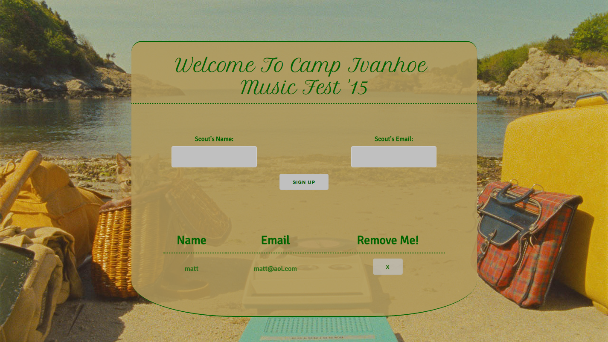

# Sinatra Email App

An app designed for bands/artists to collect fan emails and names for marketing events, like a music festival.

https://hidden-hollows-8071.herokuapp.com/

## User Stories

As a user I want to be able to
- Have customers sign up in a form, placing their name and email in a list.
- Store all emails in a database.
- Enter in my email address with proper email formatting.

## Technologies
- Backbone.js
- Sinatra
- Ruby
- Javascript/jQuery
- Skeleton CSS Framework
- JSON
- PostgreSQL

### Screenshots

